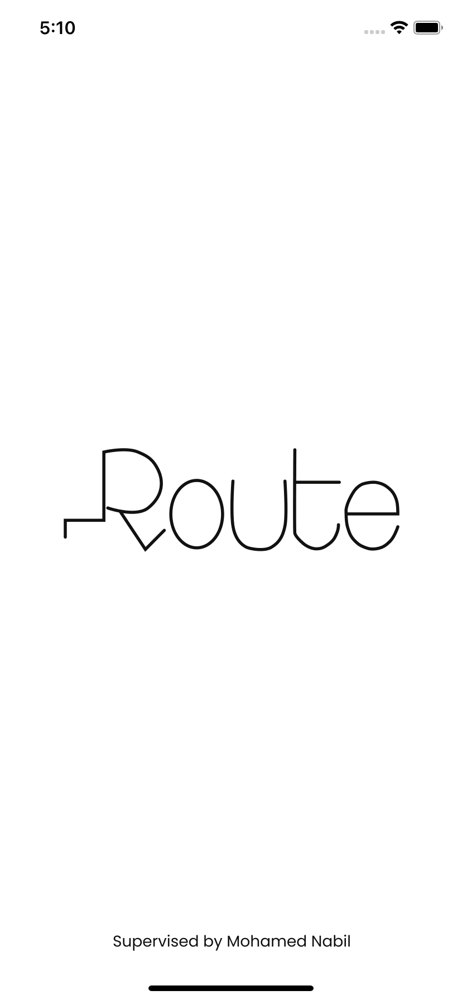
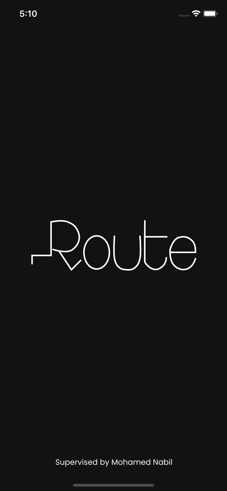
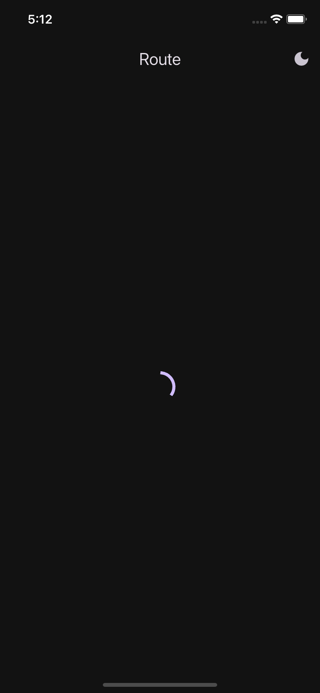
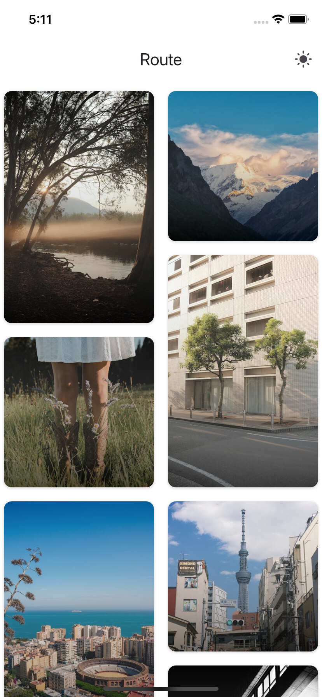
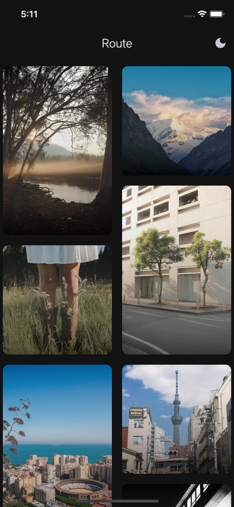
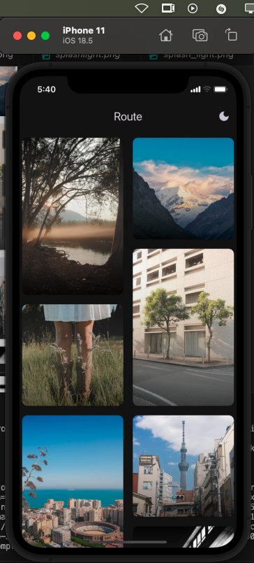
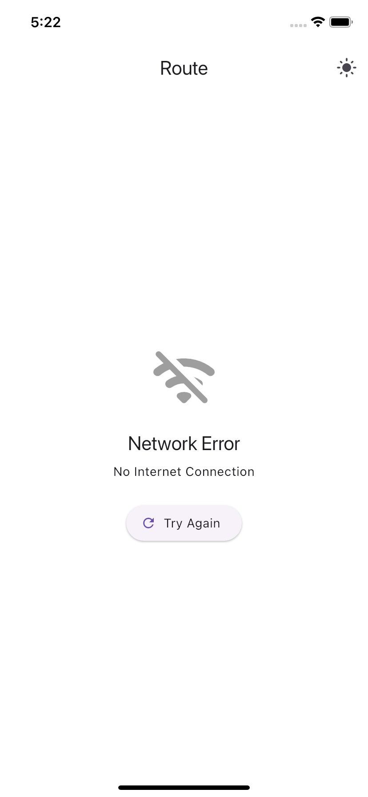
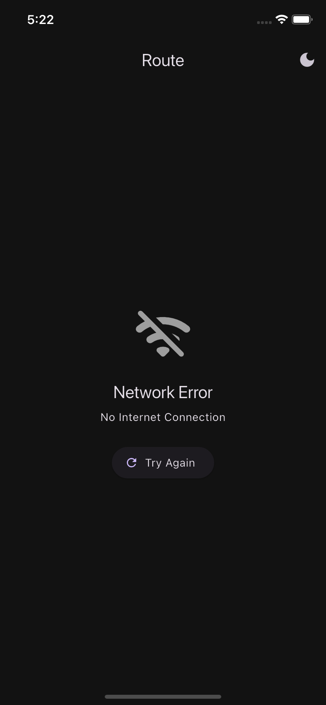

# 📸 Flutter Photo Gallery App (Clean Architecture)

A robust and intuitive photo gallery app built with Flutter, leveraging Clean Architecture. It uses Cubit for state management, Hive for caching, and fetches high-quality photos from the Pexels API. Supports both dark/light themes and full offline functionality.

GitHub Repository: [Route Job Fair](https://github.com/KhalidAbdelrazek/Route-Job-Fair)

---

## ✨ Features

- **📷 Pexels API Integration** — Fetch stunning, high-resolution photos.
- **📴 Offline Support** — View photos offline via Hive storage.
- **🖼️ Image Caching** — Cached images load smoothly offline.
- **🏗️ Clean Architecture** — Scalable, testable, and maintainable codebase.
- **🧠 Cubit State Management** — Predictable and efficient state handling.
- **📦 Hive Local Storage** — Fast, persistent caching of data.
- **🧩 Dependency Injection** — Managed via `injectable` + `get_it`.
- **🌐 Connectivity Awareness** — Real-time network status indicator.
- **🍷 Dark/Light Theme** — Seamless theming with persistent state.
- **📱 Responsive UI** — Fluid layout across all device sizes.

---

## 📁 Folder Structure

```
lib/
├── core/
│   ├── api_manager/    # API config, Dio client setup, constants
│   ├── di/             # Injectable DI setup
│   ├── errors/         # Error handling (e.g., ServerFailure, CacheFailure)
│   └── network/        # Network connectivity checker
│
└── features/
    └── photo_gallery/
        ├── data/
        │   ├── model/            # Data models for API and Hive
        │   ├── data_source/
        │   │   ├── remote/       # Retrofit API service
        │   │   └── local/        # Hive service
        │   └── repo_impl/        # Repository implementation
        │
        ├── domain/
        │   ├── entity/           # Core business entities
        │   ├── repo/             # Abstract repository contract
        │   └── use_case/         # Business logic
        │
        └── presentation/
            ├── cubit/            # Cubit state management
            ├── screens/          # UI pages
            └── widgets/          # Reusable UI components
```

---

## 🛠️ Tech Stack & Packages

| Functionality         | Package                      | Description                                               |
|----------------------|------------------------------|-----------------------------------------------------------|
| State Management      | `flutter_bloc`               | Bloc/Cubit-based architecture                             |
| Dependency Injection  | `injectable`, `get_it`       | Compile-time DI                                           |
| API & Serialization   | `retrofit`, `json_serializable` | HTTP client + JSON model generation                    |
| Data Caching          | `hive`, `hive_flutter`       | Offline local storage                                     |
| Image Caching         | `cached_network_image`       | Efficient image caching                                   |
| Connectivity Check    | `connectivity_plus`          | Monitor internet connection                               |
| Theme Persistence     | `shared_preferences`         | Save user-selected theme                                  |
| HTTP Client           | `dio`                        | Networking backend used by Retrofit                       |
| Functional Patterns   | `dartz`                      | Robust error handling via Either, functional utilities    |
| Utilities             | `equatable`, `logger`        | Value equality, structured debugging                      |

---

```yaml
dependencies:
  flutter:
    sdk: flutter

  flutter_bloc: ^8.1.3
  equatable: ^2.0.5
  dartz: ^0.10.1

  # Networking
  dio: ^5.3.3
  retrofit: ^4.1.0
  json_annotation: ^4.9.0

  # Storage
  hive: ^2.2.3
  hive_flutter: ^1.1.0
  shared_preferences: ^2.2.2
  path_provider: ^2.1.5

  # Dependency Injection
  get_it: ^7.6.0
  injectable: ^2.3.2

  # UI
  cached_network_image: ^3.3.1
  connectivity_plus: ^5.0.1
  flutter_staggered_grid_view: ^0.4.1
  pretty_dio_logger: ^1.4.0
  flutter_native_splash: ^2.4.6

dev_dependencies:
  flutter_test:
    sdk: flutter

  build_runner: ^2.4.6
  retrofit_generator: ^8.1.0
  json_serializable: ^6.7.1
  injectable_generator: ^2.4.0
  hive_generator: ^2.0.1
```

## 📷 Screenshots

| Description             | Light Mode                                                                | Dark Mode                                                                 |
|-------------------------|---------------------------------------------------------------------------|---------------------------------------------------------------------------|
| 💠 Splash Screen         |               |               |
| 🔄 Loading State         | —                                                                         |         |
| ✅ Online Photo List     |            |            |
| 📶 Offline Mode          | —                                                                         |      |
| ❌ Error State           |  |  |

---

## 🚀 Getting Started

### ✅ Prerequisites

- Flutter SDK (latest stable)
- Dart SDK
- Android Studio or VS Code

---

### 📦 Setup Instructions

```bash
# Clone the repo
git clone https://github.com/KhalidAbdelrazek/Route-Job-Fair.git
cd Route-Job-Fair

# Install dependencies
flutter pub get

# Generate necessary files (injectable, json_serializable, hive)
flutter pub run build_runner build --delete-conflicting-outputs

# Run the app
flutter run
```

---

## ⚙️ Configuration

### 🔑 Pexels API Key Setup

1. Sign up and get your key at: [Pexels API](https://www.pexels.com/api/)
2. Open: `lib/core/api_manager/api_constants.dart`
3. Replace the placeholder with your key:

```dart
class ApiConstants {
  static const baseUrl = "https://api.pexels.com/v1/";
  static const apiKey = "YOUR_PEXELS_API_KEY"; // <--- Set it here
  static const perPage = 15;
}
```

---

## 🔒 Offline Support

- **📴 Offline Mode**: Automatically loads photos from Hive if no internet.
- **🌐 Online Mode**: Downloads fresh data and caches it locally.
- **🖼️ Cached Images**: Seamless viewing of previously seen images.

---

## 🤝 Contributing

1. Fork this repo
2. Create your feature branch: `git checkout -b feature/YourFeature`
3. Commit your changes: `git commit -m 'Add feature'`
4. Push to the branch: `git push origin feature/YourFeature`
5. Open a Pull Request

---

## 📄 License

This project is licensed under the **MIT License**.  
See the `LICENSE` file for details.

---

## 🙏 Acknowledgments

- [Pexels](https://www.pexels.com/api/) — Free stock photo API
- Flutter + Dart team and package maintainers 🙌
◊
